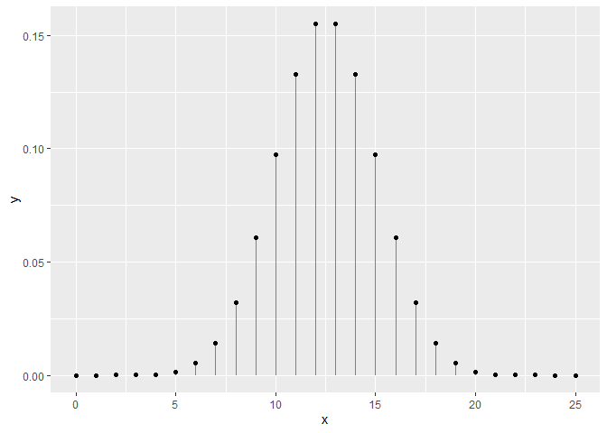
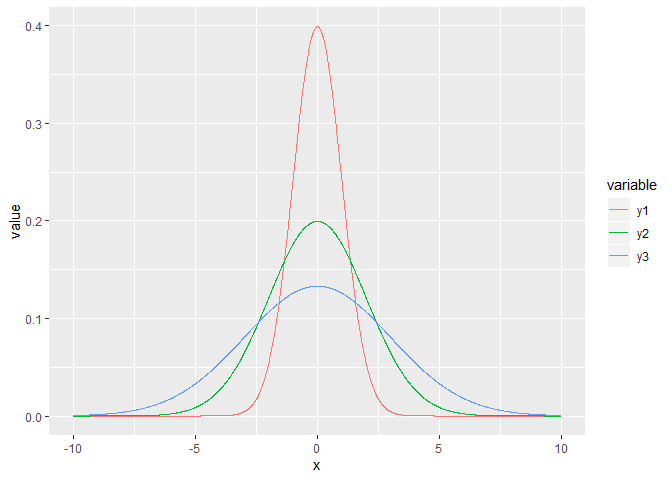
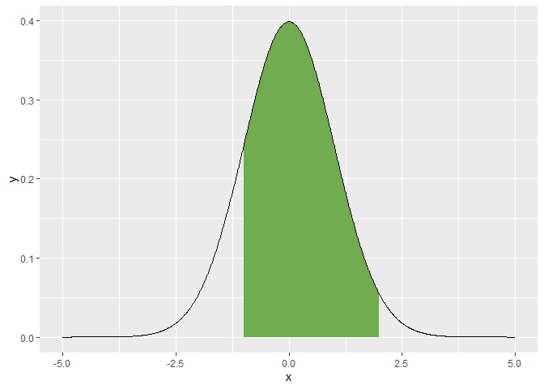
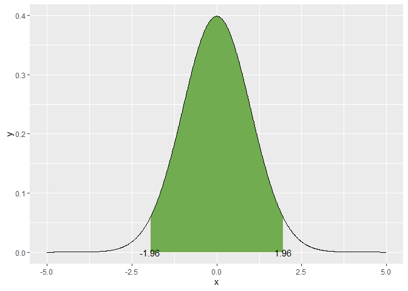
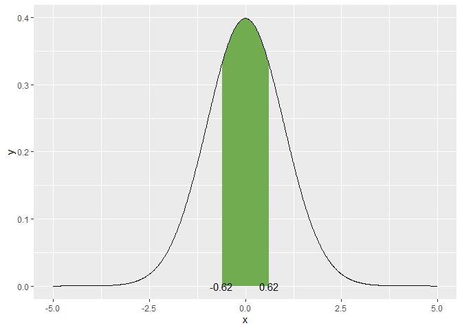

Chapitre 6
================
Andrés Silva
12/02/2020

Une **variable** est l’observation d’une caractéristique décrivant un
échantillon.

En R, une variable est associée à un vecteur ou une colonne d’un
tableau.

``` r
rho <- c(1.34, 1.52, 1.26, 1.43, 1.39) # Création de la variable rho
data <- data.frame(rho = rho) # tableau
data
```

    ##    rho
    ## 1 1.34
    ## 2 1.52
    ## 3 1.26
    ## 4 1.43
    ## 5 1.39

*Variables quantitatives* : Continues dans une espace échantillonal
réel. *Variables qualitatives* : une couleur ou une série de sol. Une
variable impossible à mesurer numériquement.

L’interprétation **bayésienne** vise à quantifier l’incertitude des
phénomènes. Dans cette perspective, plus l’information s’accumule, plus
l’incertitude diminue. L’approche bayésienne évalue la probabilité que
le modèle soit réel.

Des rivalités factices s’installent enter les tenants des différentes
approches, dont chacune, en réalité, répond à des questions différentes
dont il convient réfléchir sur les limitations.

***Les distributions***

Toujours, l’aire sous la courbe d’une distribution de probabilité est
égale à 1

En tant que scénario à deux issues possibles, des tirages à pile ou face
suivent une loi binomiale, comme toute variable booléenne prenant une
valeur vraie ou fausse.

La distribution de Poisson n’a qu’un seul paramètre \(\lambda\), qui
décrit tant la moyenne des décomptes.

``` r
library("tidyverse")
x <- 0:25
y <- dbinom(x = x, size = 25, prob = 0.5)
print(paste('La somme des probabilités est de', sum(y)))
```

    ## [1] "La somme des probabilités est de 1"

``` r
ggplot(data = tibble(x, y), mapping = aes(x, y)) +
  geom_segment(aes(x = x, xend = x, y = 0, yend = y), color = "grey50") +
  geom_point()
```

<!-- -->

La distribution la plus simple est probablement la distribution
uniforme. On utilise rarement la distribution uniforme en
biostatistiques, sinon pour décrire des a priori vagues pour l’analyse
bayésienne.

Les distributions de mesures exclusivement positives (comme le poids ou
la taille) sont parfois avantageusement approximées par une loi
log-normale, qui est une loi normale sur le logarithme des valeurs: la
moyenne d’une loi log-normale est la moyenne géométrique.

``` r
increment <- 0.01
x <- seq(-10, 10, by = increment)
y1 <- dnorm(x, mean = 0, sd = 1)
y2 <- dnorm(x, mean = 0, sd = 2)
y3 <- dnorm(x, mean = 0, sd = 3)

print(paste('La somme des probabilités est de', sum(y3 * increment)))
```

    ## [1] "La somme des probabilités est de 0.999147010743368"

``` r
gg_norm <- data.frame(x, y1, y2, y3) %>% gather(variable, value, -x)

ggplot(data = gg_norm, mapping = aes(x = x, y = value)) +
  geom_line(aes(colour = variable))
```

<!-- -->

Quelle est la probabilité d’obtenir le nombre 0 chez une observation
continue distribuée normalement dont la moyenne est 0 et l’écart-type
est de 1? Réponse: 0. La loi normale étant une distribution continue,
les probabilités non-nulles ne peuvent être calculés que sur des
intervalles. Par exemple, la probabilité de retrouver une valeur dans
l’intervalle entre -1 et 2 est calculée en soustrayant la probabilité
cumulée à -1 de la probabilité cumulée à 2.

``` r
increment <- 0.01
x <- seq(-5, 5, by = increment)
y <- dnorm(x, mean = 0, sd = 1)

prob_between <- c(-1, 2)

gg_norm <- data.frame(x, y)
gg_auc <- gg_norm %>%
  filter(x > prob_between[1], x < prob_between[2]) %>%
  #rbind() utilisé pour bien fermer le polygon dans ggplot
  rbind(c(prob_between[2], 0)) %>%
  rbind(c(prob_between[1], 0))

ggplot(data.frame(x, y), aes(x, y)) +
  geom_polygon(data = gg_auc, fill = '#71ad50') + # #71ad50 est un code de couleur format hexadécimal
  geom_line()
```

<!-- -->

``` r
# La fonction pnorm calcule la probabilité d'une valeur 
prob_norm_between <- pnorm(q = prob_between[2], mean = 0, sd = 1) - pnorm(q = prob_between[1], mean = 0, sd = 1)
print(paste("La probabilité d'obtenir un nombre entre", 
            prob_between[1], "et", 
            prob_between[2], "est d'environ", 
            round(prob_norm_between, 2) * 100, "%"))
```

    ## [1] "La probabilité d'obtenir un nombre entre -1 et 2 est d'environ 82 %"

La figure ci-dessous montre l’aire sous la courbe répresentant 95% de la
population

``` r
increment <- 0.01
x <- seq(-5, 5, by = increment)
y <- dnorm(x, mean = 0, sd = 1)

alpha <- 0.05
prob_between <- c(qnorm(p = alpha/2, mean = 0, sd = 1),
                  qnorm(p = 1 - alpha/2, mean = 0, sd = 1))

gg_norm <- data.frame(x, y)
gg_auc <- gg_norm %>%
  filter(x > prob_between[1], x < prob_between[2]) %>%
  rbind(c(prob_between[2], 0)) %>%
  rbind(c(prob_between[1], 0))

ggplot(data = data.frame(x, y), mapping = aes(x, y)) +
  geom_polygon(data = gg_auc, fill = '#71ad50') + # #71ad50 est un code de couleur format hexadécimal
  geom_line() +
  geom_text(data = data.frame(x = prob_between,
                              y = c(0, 0),
                              labels = round(prob_between, 2)),
            mapping = aes(label = labels))
```

<!-- -->

En effet, la moyenne suit aussi une distribution normale, dont la
tendance centrale est la moyenne de la distribution, et dont
**l’écart-type est noté erreur standard**.On calcule cette erreur en
divisant **la variance par le nombre d’observations, ou en divisant
l’écart-type par la racine carrée du nombre d’observations**.

``` r
increment <- 0.01
x <- seq(-5, 5, by = increment)
y <- dnorm(x, mean = 0, sd = 1)

alpha <- 0.05
prob_between <- c(qnorm(p = alpha/2, mean = 0, sd = 1) / sqrt(10),
                  qnorm(p = 1 - alpha/2, mean = 0, sd = 1) / sqrt(10))

gg_norm <- data.frame(x, y)
gg_auc <- gg_norm %>%
  filter(x > prob_between[1], x < prob_between[2]) %>%
  rbind(c(prob_between[2], 0)) %>%
  rbind(c(prob_between[1], 0))

ggplot(data = data.frame(x, y), mapping = aes(x, y)) +
  geom_polygon(data = gg_auc, fill = '#71ad50') + # #71ad50 est un code de couleur format hexadécimal
  geom_line() +
  geom_text(data = data.frame(x = prob_between,
                              y = c(0, 0),
                              labels = round(prob_between, 2)),
            mapping = aes(label = labels))
```

<!-- -->

**Statistiques descriptives**
